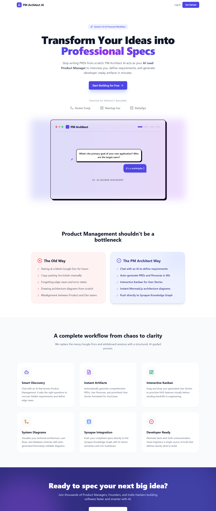
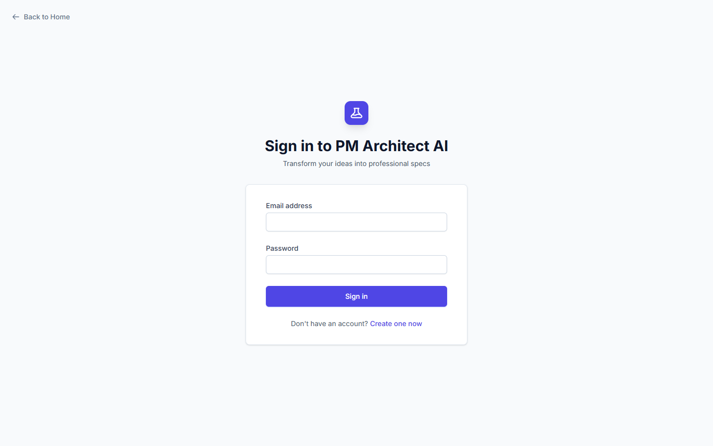
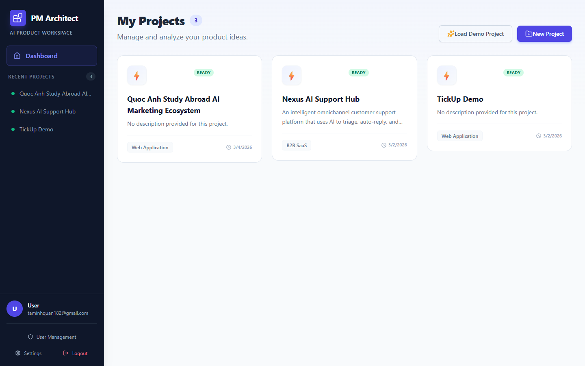
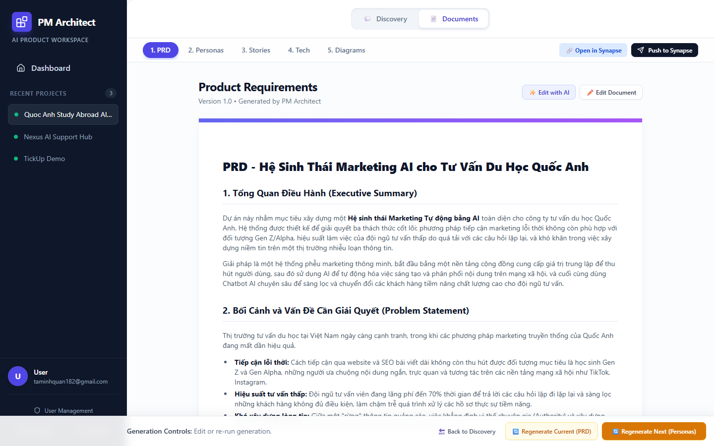
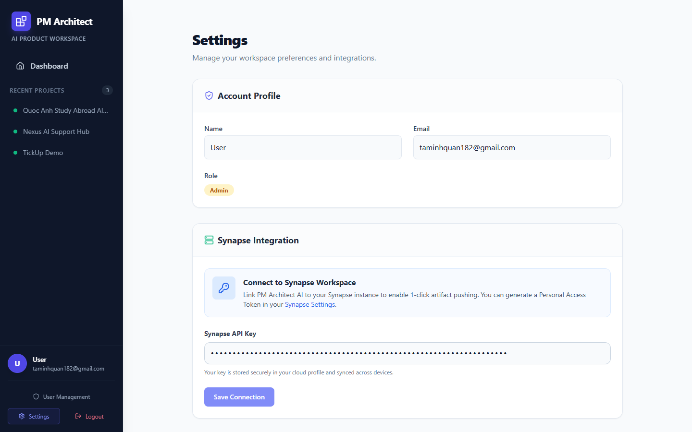

# PM Architect AI

  

  <strong>Workspace AI cho Product Management giúp biến ý tưởng thô thành bộ tài liệu có cấu trúc để có thể bắt tay vào làm.</strong>

  PM Architect AI giúp founder, PM và builder đi từ ý định sản phẩm còn mơ hồ
  sang PRD, personas, user stories, architecture và một bộ thinking sẵn sàng cho delivery.

  
  
  
  

  <a href="README.md"><strong>Đọc bản tiếng Anh</strong></a> |
  <strong>Đọc bằng tiếng Việt</strong>

  <a href="https://pmarchitechai.alphatech.ai.vn/"><strong>Trang Live</strong></a>
  |
  <a href="SUPPORT.md"><strong>Hỗ Trợ</strong></a>
  |
  <a href="docs/FAQ.md"><strong>Câu Hỏi Thường Gặp</strong></a>

## Cú Chuyển Lớn

Rất nhiều công việc product giai đoạn đầu vẫn bắt đầu theo cách rất lộn xộn:

- Ý tưởng nằm trong nhiều ghi chú rời rạc,
- Requirements giữ mơ hồ quá lâu,
- PM artifacts được viết rất muộn,
- Team tốn thời gian tranh luận cấu trúc thay vì đi tiếp,
- Architecture và user stories trở thành một việc cleanup thủ công.

PM Architect AI đổi loop đó.

Nó cho phép người dùng đi qua một AI-guided discovery flow, sau đó biến ý tưởng sản phẩm đã rõ hơn thành một workspace có PRD, personas, user stories, technical architecture, diagrams và được lưu lại để tiếp tục sử dụng.

Điểm "wow" không chỉ là AI viết ra một document.  
Điểm "wow" là product thinking trở thành một workspace có thể tiếp tục xây dựng, thay vì một cuộc brainstorm dùng một lần.

> Từ bản năng sản phẩm còn thô thành một workspace có cấu trúc, sẵn sàng cho delivery.

## Vì Sao Trải Nghiệm Này Khác

1. **Discover** ý tưởng thông qua hội thoại AI có dẫn dắt.
2. **Generate** bộ PM artifacts trong một flow thống nhất.
3. **Continue** tinh chỉnh và quản lý các artifact trong workspace lưu trữ lâu dài.

Repository này là hub public để giới thiệu sản phẩm và hỗ trợ cho PM Architect AI. Nó không chứa source code của ứng dụng.

## Bạn Nhận Được Gì

- `AI Discovery Flow` để làm rõ goals, users và scope trước khi generate
- `PM Artifact Suite` cho PRDs, personas, stories, technical architecture và diagrams
- `Persistent Workspace` với dashboard, projects và settings
- `Delivery Shape` giúp product thinking gần hơn với execution
- `Knowledge Sync` qua Synapse integration để đẩy artifact sang hệ thống khác

## Nhìn Nhanh

- Nền tảng web hosted
- Landing page và workspace có xác thực
- Dashboard và các project đã lưu
- PM documents do AI tạo
- Settings và integration surface
- Synapse push workflow

## Xem Nhanh Giao Diện

  
  
  

  
  

## Dành Cho Ai

- Founders cần biến ý tưởng thô thành direction rõ ràng
- Product managers cần một first-draft system nhanh hơn
- Builders muốn có spec rõ hơn trước khi vào development
- Teams muốn đẩy PM artifacts vào broader knowledge workflow

## PM Architect AI Làm Được Gì

- Cung cấp landing page public cho sản phẩm
- Hỗ trợ login và authenticated workspace access
- Lưu và hiển thị projects trong dashboard
- Tạo PM artifacts như PRDs, personas, stories, architecture và diagrams
- Cung cấp settings cho account và Synapse integration

## Vì Sao Sản Phẩm Này Tồn Tại

PM Architect AI không có tham vọng thay thế product judgment.

Nó tồn tại để giải một bài toán hẹp và thực tế hơn:

> "Team có một ý tưởng, nhưng cần một cách nhanh hơn để biến nó thành bộ tài liệu sản phẩm hữu dụng trước khi động lực phát triển bị mất."

Vì vậy sản phẩm này giống một AI PM workspace hơn là công cụ viết nội dung tổng quát.

## Vì Sao Người Dùng Nhớ Nó

- Vì PM output đến nhanh hơn thay vì bị trễ
- Vì nó nén discovery và documentation vào cùng một flow
- Vì nó nối ideation với execution artifacts có cấu trúc
- Vì nó cho team thứ để tiếp tục refine, không chỉ ngắm một lần rồi bỏ

## Phạm Vi Sản Phẩm

### Đã Có Sẵn

- Landing page hosted
- Login flow
- Authenticated dashboard
- Saved project workspace
- PRD, personas, stories, tech, và diagrams surfaces
- Synapse integration settings

### Lưu Ý Quan Trọng

- PM Architect AI không phải PM tool open-source
- Repository này không phải repo source hay repo deploy
- Chất lượng output phụ thuộc vào input, framing và human review
- Artifact được generate để tăng tốc công việc, không thay thế product leadership

## Mô Hình Riêng Tư

PM Architect AI là một sản phẩm web hosted.

Hành vi dữ liệu ở mức high-level:

- visitor có thể browse landing page công khai,
- user đã đăng nhập có thể truy cập workspace và project đã lưu,
- project content và artifact có thể được lưu trên server để phục vụ trải nghiệm,
- provider AI và integration bên ngoài có thể xử lý content tùy theo cấu hình đang bật.

Xem [docs/PRIVACY.md](docs/PRIVACY.md) để đọc bản privacy tóm tắt.

## Các Bề Mặt Sản Phẩm

- Public marketing layer: landing page và login
- Workspace layer: dashboard, project detail, generated artifacts
- Settings layer: account preferences và Synapse integration

## Tình Trạng Phát Hành

- Public site: https://pmarchitechai.alphatech.ai.vn/
- Loại sản phẩm: workspace AI hosted cho product management
- Trạng thái hiện tại: landing page public với project workspace có xác thực

## Bắt Đầu Trong 3 Bước

1. **Visit** live site để hiểu lời hứa sản phẩm và cảm giác workspace.
2. **Review** screenshot và docs trong repo để thấy rõ artifact và settings surfaces.
3. **Reach Out** qua support nếu cần access, context về sản phẩm, hay thảo luận deployment.

## Bắt Đầu Từ Đây

- `Trang Live`: https://pmarchitechai.alphatech.ai.vn/
- `Hỗ Trợ`: [SUPPORT.md](SUPPORT.md)
- `Câu Hỏi Thường Gặp`: [docs/FAQ.md](docs/FAQ.md)
- `Lộ Trình`: [docs/ROADMAP.md](docs/ROADMAP.md)

## Hỗ Trợ

- Email liên hệ: `taminhquan182@gmail.com`

## Khám Phá PM Architect AI

  <strong>Muốn xem cách một ý tưởng có thể thành PRD, stories, architecture và một workspace sống?</strong> 
  Hãy vào live site trước, sau đó dùng support path nếu cần hỏi về access hay sản phẩm.

  <a href="https://pmarchitechai.alphatech.ai.vn/"><strong>Mở Trang Live</strong></a>
  |
  <a href="SUPPORT.md"><strong>Liên Hệ Hỗ Trợ</strong></a>

## Lưu Ý Closed-Source

PM Architect AI là sản phẩm closed-source của AlphaTech.

Repository này tồn tại để:

- giải thích sản phẩm
- cho thấy năng lực hiện tại
- công bố screenshot và tài liệu public
- cung cấp đầu mối support và security contact

Nó không bao gồm:

- application source code
- private backend hoặc deployment code
- user credentials
- secret infrastructure hoặc keys
- private project data

## Phạm Vi Repository

Repo này chỉ nên chứa:

- product overview
- câu hỏi thường gặp
- privacy summary
- roadmap
- support và security contacts
- screenshots

Nếu sau này có public documentation site hoặc release flow riêng, phần đó nên được document rõ ràng thay vì để người xem tự suy diễn từ repo này.
